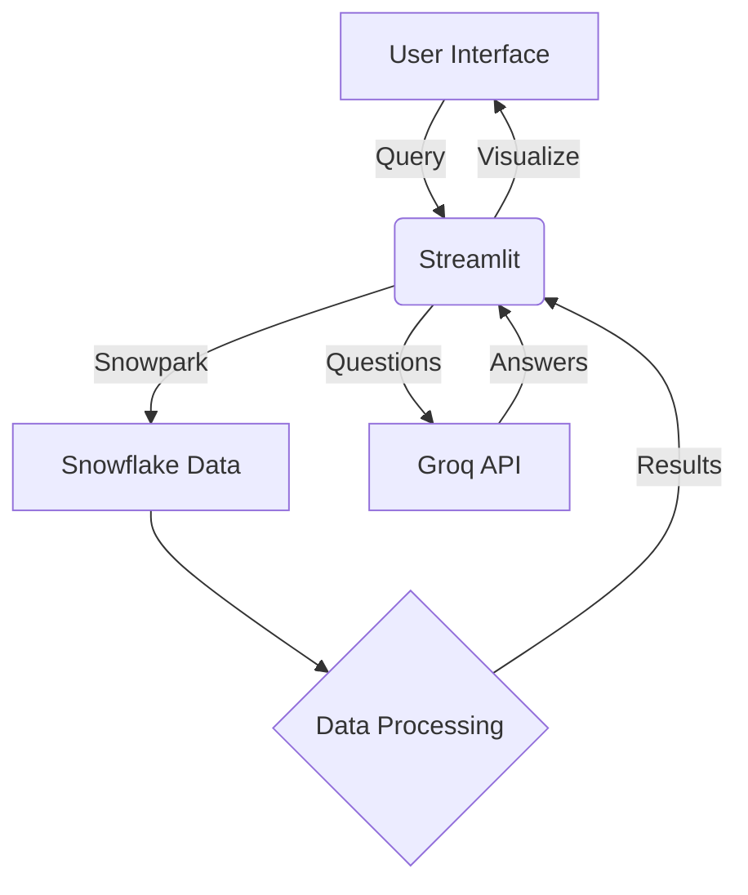

# SanskritiScope 🌍✨  
**Preserving India's Heritage Through Data & Responsible Tourism**

---

## 📌 Project Overview  
**SanskritiScope** is an AI-powered platform designed to promote **sustainable tourism** and preserve **endangered Indian art forms**. By leveraging data-driven insights, interactive maps, and an AI chatbot, it connects travelers with lesser-known cultural sites, festivals, and heritage experiences across India.  

### 🎯 Key Objectives  
- **Discover**: Explore endangered art forms using interactive maps and filters.  
- **Recommend**: Generate personalized cultural travel itineraries.  
- **Educate**: Provide insights about India's heritage via an AI-powered chatbot.  
- **Promote**: Highlight local festivals and events to boost responsible tourism.  

---

## 🛠 Tech Stack  

### 🌐 Backend  
| Technology       | Use Case                              |
|------------------|---------------------------------------|
| [Snowflake](https://www.snowflake.com/) | Cloud data warehouse for storing heritage datasets |
| [Snowpark (Python)](https://docs.snowflake.com/en/developer-guide/snowpark/python/index) | Query and process data directly within Snowflake |
| [Haversine Formula](https://en.wikipedia.org/wiki/Haversine_formula) | Calculate distances for travel recommendations |

### 💡 AI & APIs  
| Technology       | Use Case                              |
|------------------|---------------------------------------|
| [Groq API (LLaMA-4)](https://x.ai/api) | Powers the AI Cultural Guide chatbot |
| [Pandas](https://pandas.pydata.org/) / [NumPy](https://numpy.org/) | Data processing and scoring for recommendations |

### 📊 Frontend  
| Technology       | Use Case                              |
|------------------|---------------------------------------|
| [Streamlit](https://streamlit.io/) | Python-based interactive web app |
| [Folium](https://python-visualization.github.io/folium/) | Interactive maps with custom markers |
| [Streamlit-Folium](https://github.com/randyzwitch/streamlit-folium) | Embed Folium maps in Streamlit |

---

## 🔌 API Usage  

### ⚡ Groq API (LLaMA-4) 🤖  
**API Name**: Groq API  
**Model Used**: LLaMA-4  
**Purpose**: Powers the AI Cultural Guide chatbot for real-time heritage insights.  

**Implementation**:  
1. User inputs queries via the Streamlit interface.  
2. Queries are sent to Groq's LLaMA-4 model through a secure API call.  
3. Responses are displayed in the chatbot UI.  
4. 🔐 API key is securely stored in environment variables (`.env`).  

---

## 🧩 Snowflake + Streamlit Integration  

### 🔗 Connection Architecture  
1. **Snowflake Setup**:  
   - Stores heritage datasets (art forms, coordinates, UNESCO status, festival details) in structured tables.  
2. **Snowpark Python**:  
   - Enables direct querying and data manipulation within Snowflake.  
   - Eliminates the need for a separate ETL pipeline.  
3. **Streamlit App**:  
   - Connects to Snowflake using credentials stored in `secrets.toml`.  
   - Visualizes real-time data through interactive UI components.  

### ✅ Advantages  
- **Zero Data Duplication**: Data resides solely in Snowflake.  
- **Live Querying**: Ensures up-to-date recommendations and insights.  
- **Efficient Processing**: Snowpark handles complex computations seamlessly.  

---

## 🔁 System Architecture & Data Flow  



## ⚙️ How It Works

## 🔍 Data Pipeline

- **Snowflake**: Acts as the central repository for heritage data.  
- **Snowpark**: Processes queries and applies filters using Python.  
- **Streamlit**: Renders interactive UI with maps, filters, and chatbot.  
- **Groq API**: Handles user queries for cultural insights and Q&A.

---

## 📍 Recommendation Algorithm

The platform uses a scoring system to prioritize travel recommendations:

```python
def calculate_score(row):
    score = 0
    if row['ENDANGERED'] == "Yes": score += 2
    if row['UNESCO'] == "Yes": score += 1
    score -= (0.01 * row['DISTANCE_KM'])  # Penalize longer distances
    return score
```

**Inputs**: Art form metadata, UNESCO status, and distance (calculated via Haversine formula).  
**Output**: Ranked list of cultural sites for personalized itineraries.

---

## 🚀 Key Features

### 🗺️ Art Explorer

- Filter art forms by state, region, or endangerment status.  
- Visualize sites on an interactive Folium-powered map.  
- View detailed metadata (history, significance, preservation status).

### 🛤️ Smart Routes

- AI-curated travel itineraries prioritizing endangered sites.  
- Distance-optimized paths using the Haversine formula.  
- Exportable routes for trip planning.

### 🤖 Chatbot Guide

- Powered by Groq's LLaMA-4 model.  
- Provides instant insights into art forms, festivals, and cultural history.  
- Contextual responses tailored to user queries.

### 🗓️ Festival Calendar

- Browse cultural festivals by month or state.  
- Filter events based on proximity or cultural significance.  
- Learn about festival history and local impact.

---

## 📈 Why This is Innovative?

- **Data-Driven Preservation**: Directs tourism to at-risk art forms, supporting local communities.  
- **Hybrid Intelligence**: Combines Snowflake's analytics with LLaMA-4's conversational AI.  
- **Serverless Architecture**: Scalable, low-maintenance infrastructure.  
- **Impact Tourism**: Measurable contributions to cultural preservation and local economies.

---

## 🌍 Getting Started

### 📋 Prerequisites

- Python 3.8+  
- Snowflake account with Snowpark enabled  
- Groq API key (sign up at [x.ai/api](https://x.ai/api))  
- Git installed for cloning the repository

---

### 🛠 Installation

**Clone the Repository:**
```bash
git clone https://github.com/<your-username>/cultural-lens.git
cd cultural-lens
```

**Install Dependencies:**
```bash
pip install -r requirements.txt
```

**Set Up Environment Variables:**  
Create a `.env` file in the project root and add:
```
SNOWFLAKE_ACCOUNT=<your-account>
SNOWFLAKE_USER=<your-username>
SNOWFLAKE_PASSWORD=<your-password>
SNOWFLAKE_DATABASE=<your-database>
SNOWFLAKE_SCHEMA=<your-schema>
GROQ_API_KEY=<your-groq-api-key>
```

**Configure Streamlit Secrets:**  
Create a `secrets.toml` file in the `.streamlit/` directory:
```toml
[snowflake]
account = "<your-account>"
user = "<your-username>"
password = "<your-password>"
database = "<your-database>"
schema = "<your-schema>"
```

**Run the Application:**
```bash
streamlit run app.py
```

**Access the App:**  
Open your browser and navigate to `http://localhost:8501`.

---

## 📂 Project Structure

```
cultural-lens/
├── 📄 app.py               # Main Streamlit application
├── 📄 recommender.py       # Core recommendation logic
├── 📄 requirements.txt     # Python dependencies
├── 📄 README.md            # Project documentation
├── 📂 .streamlit/          # Streamlit configuration
│ └── 🔐 secrets.toml       # API/Snowflake credentials
├── 📂 data/                # Sample datasets
├── 🖼️ images/              # Images used in the app
├── 📂 pages/               # Streamlit multipage app components
│ ├── 1_🎨_Endangered_art_forms.py          # Form for endangered art
│ ├── 2_📍_Cultural_Spot_Recommender.py     # Cultural spot recommendations
│ ├── 3_🤖_Chatbot.py                       # Chatbot integration
│ └── 4_📆_Seasonality_&_Cultural_Calendar.py # Calendar of cultural events
├── 📂 venv/                # Virtual environment 
         
```

---

## 🛠 Contributing

We welcome contributions to enhance Cultural Lens! To contribute:

1. Fork the repository.  
2. Create a new branch:  
   ```bash
   git checkout -b feature/<your-feature>
   ```
3. Commit your changes:  
   ```bash
   git commit -m "Add <your-feature>"
   ```
4. Push to the branch:  
   ```bash
   git push origin feature/<your-feature>
   ```
5. Open a Pull Request.

Please follow the Code of Conduct and ensure your code adheres to the project's style guidelines.

---

## 📜 License

This project is licensed under the **MIT License**.

---

## 🙌 Acknowledgments

- **Snowflake** for scalable data warehousing.  
- **Groq** for powering the AI chatbot.  
- **Streamlit** and **Folium** for seamless UI and mapping.  
- The **open-source community** for inspiration and tools.

---

## 📬 Contact

For questions, suggestions, or collaboration, reach out to:

**GitHub**: [Simran Shaikh](https://github.com/SimranShaikh20)

---

**Let's preserve India's cultural heritage together! 🌟**
