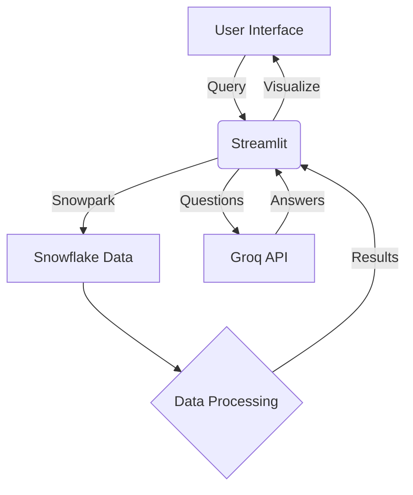

# Cultural Lens 🌍✨  
**Preserving India's Heritage Through Data & Responsible Tourism**  

---

## 📌 Overview  
**Cultural Lens** is an AI-powered platform that helps travelers explore and support **endangered Indian art forms** through data-driven recommendations. By connecting tourists with lesser-known cultural sites, we promote sustainable tourism while preserving traditional heritage.  

### 🎯 Key Objectives  
- ✔ **Discover** endangered art forms using interactive maps & filters  
- ✔ **Recommend** personalized cultural travel routes  
- ✔ **Educate** via an AI chatbot about India's heritage  
- ✔ **Promote** festivals & events to boost local tourism  

---

## 🛠 Tech Stack  

### 🌐 Backend  
| Technology       | Use Case                              |
|------------------|---------------------------------------|
| Snowflake        | Cloud data warehouse (stores heritage data) |
| Snowpark (Python)| Query & process data directly in Snowflake |
| Haversine Formula| Calculate distances for travel recommendations |

### 💡 AI & APIs  
| Technology       | Use Case                              |
|------------------|---------------------------------------|
| Groq API (LLaMA-4)| AI-powered cultural chatbot |
| Pandas/Numpy     | Data processing & scoring for recommendations |

### 📊 Frontend  
| Technology       | Use Case                              |
|------------------|---------------------------------------|
| Streamlit        | Interactive web app (Python-based UI) |
| Folium           | Interactive maps with custom markers |
| Streamlit-Folium | Embed Folium maps in Streamlit |

---

## 🔌 API Usage  
### ⚡ Groq API (LLaMA-4) 🤖  
**API Name**: Groq API  
**Model Used**: LLaMA-4  

**Purpose**: Powers the AI Cultural Guide chatbot  

**Implementation**:  
1. User input captured in Streamlit interface  
2. Query sent to Groq's LLaMA-4 via secure API call  
3. Response displayed in chatbot UI  
4. 🔐 API key secured via environment variables  

---

## 🧩 Snowflake + Streamlit Integration  
### 🔗 Connection Architecture  
1. **Snowflake Setup**:  
   - Heritage dataset (art forms, coordinates, UNESCO status) stored in tables  
2. **Snowpark Python**:  
   - Direct querying and data manipulation  
   - No separate ETL pipeline needed  
3. **Streamlit App**:  
   - Credentials secured via `secrets.toml`  
   - Real-time data visualization  

### ✅ Advantages  
- Zero data duplication  
- Live querying for up-to-date information  
- Efficient computation of travel recommendations  

---

## 🔁 System Architecture & Data Flow  


## ⚙️ How It Works

### 🔍 Data Pipeline
- **Snowflake**: Central data repository  
- **Snowpark**: Processes queries/filters in Python  
- **Streamlit**: Interactive UI rendering  
- **Groq API**: Cultural Q&A system  

### 📍 Recommendation Algorithm
```python
def calculate_score(row):
    score = 0
    if row['ENDANGERED'] == "Yes": score += 2
    if row['UNESCO'] == "Yes": score += 1
    score -= (0.01 * row['DISTANCE_KM']) 
    return score

  ## 🚀 Key Features

### 🗺️ Art Explorer  
- State/region filters  
- Folium-powered interactive map  
- Detailed cultural metadata  

### 🛤️ Smart Routes  
- AI-curated itineraries  
- Priority to endangered sites  
- Distance-optimized paths  

### 🤖 Chatbot Guide  
- Instant heritage insights  
- LLaMA-4 powered responses  
- Cultural context provider  

### 🗓️ Festival Calendar  
- Monthly event browser  
- State-wise filtering  
- Cultural significance explanations  

---

## 📈 Why This is Innovative?

✅ **Data-Driven Preservation** – Targets tourism to at-risk art forms  
✅ **Hybrid Intelligence** – Combines Snowflake analytics with LLM capabilities  
✅ **Serverless Architecture** – No infrastructure management needed  
✅ **Impact Tourism** – Creates measurable cultural impact  

---

## 🌍 Get Started

1. **Clone repository**

2. **Install dependencies:**

```bash
pip install -r requirements.txt
      